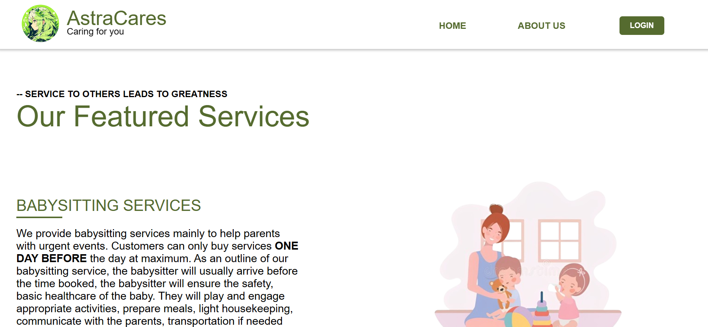

<h1>I miss her</h1>
<h2>Welcome to our final project</h2>

This project is made by:

<ul>
  <li>Albertus</li>
  <li>Gabriel</li>
  <li>Rafael</li>
</ul>
  

<h2>Introduction</h2>
<h4>AstraCares provides services such as babysitting, nanny, and governess services. Our Vision is to be the trusted partner in nurturing happy childhoods, where parents find reliable and caring babysitters effortlessly, fostering a community where children thrive in a safe and loving environment..</h4>
<h4>You can visit our website <a href="https://gamakagami.github.io/Imissher-Project/" target="_blank">here</a> </h4>

Demo Video:
<a href="https://drive.google.com/file/d/1Ipa0qguuxAsJAL-2GNnUs5Zr-Lu3urSA/view?usp=sharing">https://drive.google.com/file/d/1Ipa0qguuxAsJAL-2GNnUs5Zr-Lu3urSA/view?usp=sharing</a>

Report:
<a href ="https://drive.google.com/file/d/1VssyKlrfDJVmp6Z8j-sRMVUkcueRq0Ws/view?usp=sharing">https://drive.google.com/file/d/1vMb77zVv4d1MhBot0VmdaxVA6zzRTwN0/view?usp=sharing</a>
<h2>WebPages</h2>
<ul>
  <li>HomePage</li>
  <li>Login / Signup</li>
  <li>About Us</li>
  <li>Services</li>
  <li>Dashboard</li>
  <li>Choosing of services</li>
</ul>
<h2>Design</h2>
<h3>HomePage: It is where the users are briefly introduced about the services we provide.</h3>

<h2>Login / Signup : Users are able to create their own account and login, in order to order our services.</h2>

<h2>About Us : We introduce our company deeper, so the users know us better.</h2>

<h2>Services : We provide the description of the services and the prices of each one of them.</h2>

<h2>Dashboard : It is when the users have login to their account, and they are able to access some cool features in it.</h2>

<h2>Choosing of services</h2>

<h2>Schedule</h2>

<h2>Finance</h2>

<h2>Account</h2>

<h2>Help</h2>

